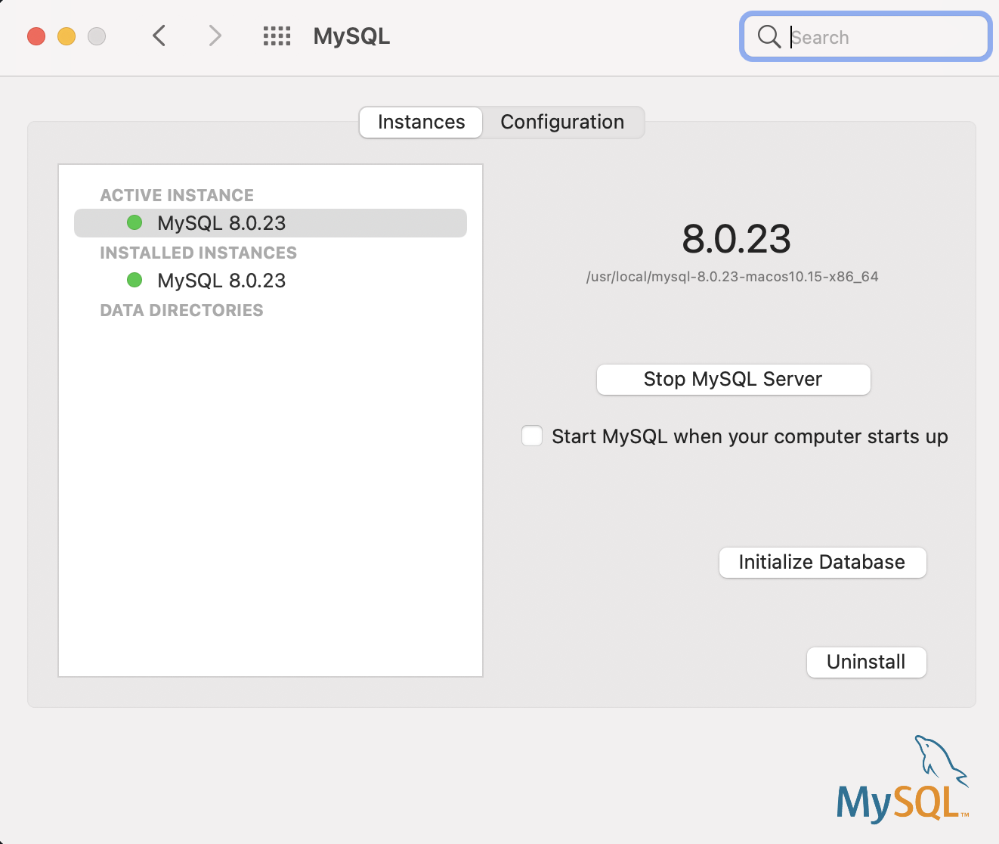

# MySQL Database Basics
<br>

## Install and Configuration
1. Download Community version of MySQL from https://www.mysql.com/downloads/. Choose the **MySQL Community (GPL) Downloads** and then **MySQL Community Server** since it is free and we just use it for learning. For MacOS, we will download the ```.dmg``` file.

2. Install the MySQL using the installer you just downloaded. You need to offer a account name and password for root account.

3. On MacOS system, MySQL is downloaded to ```/usr/local/mysql``` by default, which is the home directory for MySQL. Set a ```$MYSQL_HOME``` variable for MySQL home directory. In ```~/.bash_profile``` or ```~/.zshrc``` file, add:
    ```shell
    MYSQL_HOME=/usr/local/mysql
    export MYSQL_HOME
    ```

3. There are many command line interface (CLI) tools under ```$MYSQL_HOME/bin``` such as ```mysql``` command. It will be convenient to add them to system path.
    ```shell
    PATH=$MYSQL_HOME/bin:$PATH
    export PATH
    ```
<br>

## Start and shutdown the MySQL server
In MacOS, open the *System Preferences* panel and find the *MySQL* at the bottom. You can start and shutdown MySQL server in the management panel.


<br>

## Connect to MySQL
In command line:
```shell
shell> mysql -h host -u user -p
shell> password: xxxxx
```

If you host MySQL locally, you can omit ```-h host``` parameter. Here is an example to connect using the root account you just created when installing MySQL.
```shell
shell> mysql -u root -p
shell> password: xxxxx
```

You can also input command with password in oneline, but it is not recommended for security reasons.
```shell
shell> mysql -u root -padmin
```
Here, "admin" is the password.

After login successfully, you will enter the MySQL interactive shell. Can type ```quit``` to quit.
```shell
mysql> quit;
```
<br>

## Basic CLI Commands
All the commands are case insensitive in MacOS system.

#### List all the databases
```shell
mysql> show databases;
```

#### Create Database
```shell
mysql> create database if not exists [db_name];
```

#### Enter / Use a database
```shell
mysql> use [db_name]
```

#### List Tables
```shell
mysql> show tables;
```

#### Show Table Schema Definition
```shell
mysql> describe [db_name]
```

#### Delete Table
```shell
mysql> drop table if exists [db_name];
```

#### Insert Data into Database
```shell
mysql> insert into [db_name]
       values('kyle', 1, 'snoopy', NULL);
```

#### Retrieve Information
Detailed tutorials about retrieving data here: https://dev.mysql.com/doc/refman/8.0/en/retrieving-data.html


